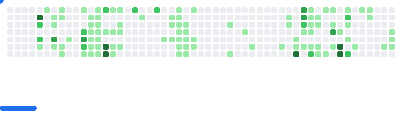

### Hi there, I am Anass Aka - *rocker*bell👋

Here are some ideas to get you started:

- 🌱 I’m currently learning everything
- 👯 I’m looking to collaborate on open source projects
- 💬 Ask me about anything, i am open to talk 

### Languages and Tools:

---

### 🎮 GitHub Breakout

<picture>
  <source media="(prefers-color-scheme: dark)" srcset="images/breakout-dark.svg" />
  <source media="(prefers-color-scheme: light)" srcset="images/breakout-light.svg" />
  
</picture>

